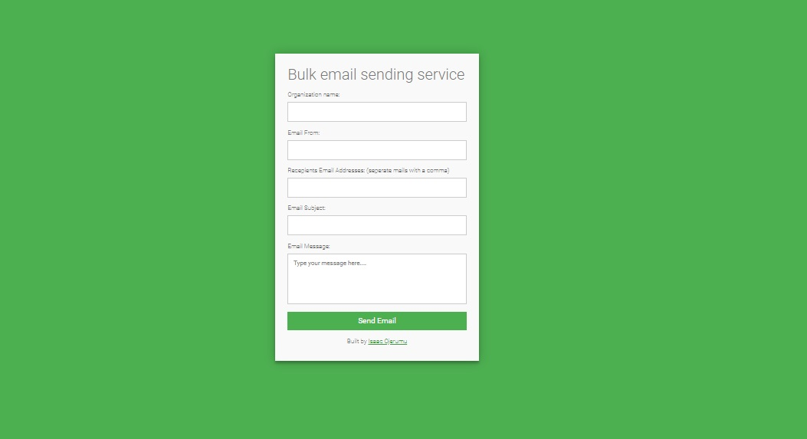

# BULK EMAIL SENDING SERVICE
This is a bulk email sending service powered by PHP

## Requirements
- [PHP](https://www.php.net/downloads.php) version 7 or higher
- [MySQL](https://dev.mysql.com/doc/) The world's most popular open source database
- Web hosting eg: [Hostinger](https://www.hostinger.com/web-hosting), [Namecheap](https://www.namecheap.com/hosting/), [Domainking](https://clients.domainking.ng/store/web-hosting) or (localhost)[https://www.apachefriends.org/download.html]

## How to install
- Clone the repository
- `git clone https://github.com/OjerIsaac/bulk_email_service.git`
- `cd bulk_email_service`
- Spin off your development server

  

